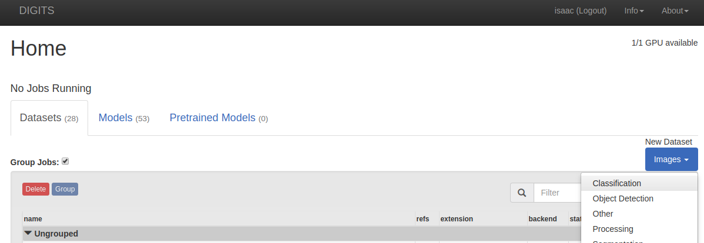
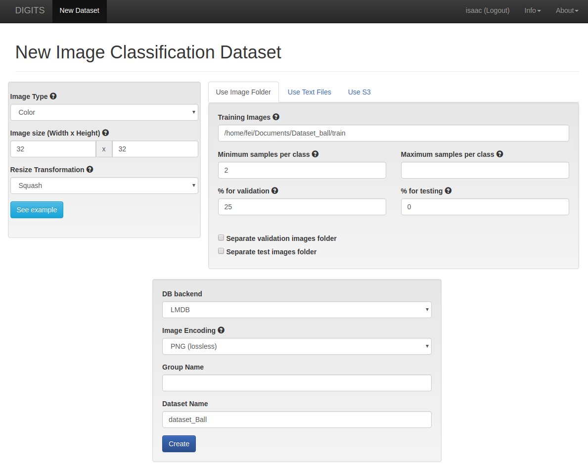

# Trainning a Deep Neural Network.

The images must be extracted from the robot’s camera, after the images to classify should be extract using your program that select a rectangular region of interest (ROI) in images, and the images should be separated in 2 classes referring ball and no ball.

Then use the [NVIDIA DIGITS](https://github.com/NVIDIA/DIGITS) to create a dataset to trainning.

On the DIGITS homepage, click `New Dataset > Text > Classification`:

- change the image height and width to `32`,
- point to the location of your dataset,
- use 25% of samples for validation and 0% for testing (you can change this values),
- give your dataset a name then click the "Create" button.

