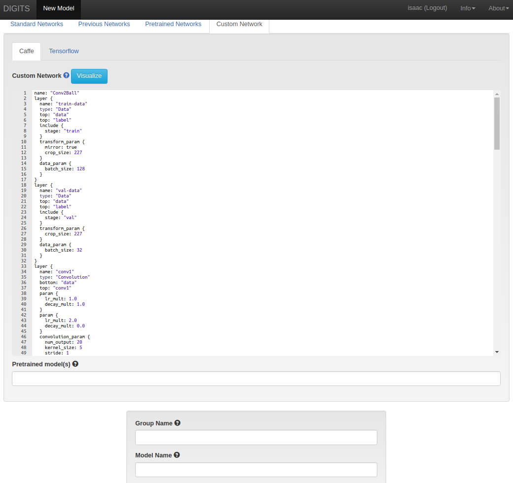

# Trainning a Deep Neural Network.

The images must be extracted from the robot’s camera, after the images to classify should be extract using your program that select a rectangular region of interest (ROI) in images, and the images should be separated in 2 classes referring ball and no ball.

Then use the [NVIDIA DIGITS](https://github.com/NVIDIA/DIGITS) to create a dataset to trainning.

## Dataset Creation in Digits

On the DIGITS homepage, click `New Dataset > Text > Classification`:

- change the image height and width to `32`,
- point to the location of your dataset,
- use 25% of samples for validation and 0% for testing (you can change this values),
- give your dataset a name then click the "Create" button.

## Perform a Trainning in Digits

After you have a digits dataset, you should perform a trainning.

Click `New Model > Images > Classification`.

On the model creation page:
- select the dataset you just created,
- set the Mean Subtraction method to "image",

- select the "Custom Network" pane then click "Caffe",

- in the Custom Network field paste this [network definition](modelNetwork.txt)
- give your model a name

When you are ready, click the "Create" button.

After a few minutes of training, your network loss and accuracy may look like:

Optionally, for better results:
- change the number of training epochs,
- change the validation interval,
- click "Show advanced learning rate options" and change the learning rate policy,
- change the Gamma.

The model is a typical image classification convolutional neural network, with two convolutional layers, max pooling, dropouts and a linear classifier.

