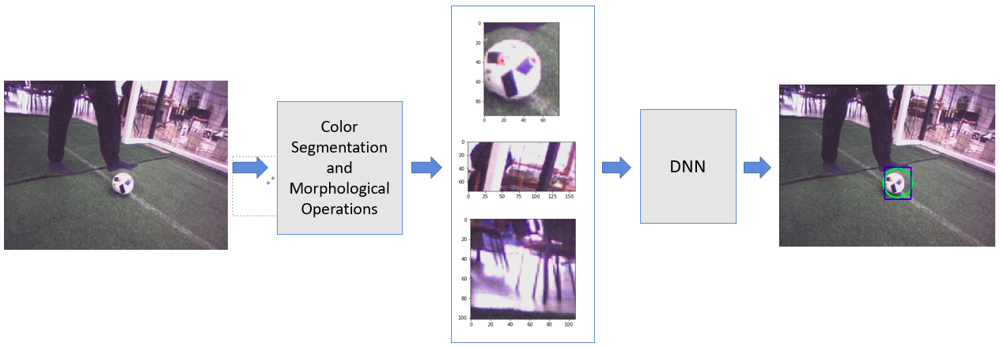

# Ball Detect using Deep Neural Network

In this work, the color segmentation and morphological transformations were used for ROI. The color segmentation identify the white regions on the image, then a binarized image of these regions is then created and a sequence of dilation and erosion are performed, as shows in Figure \ref{fig:ballDet} the ROI are extracted and used in DNN Input to classify whether is ball image.

## Deep Neural Network

To classify the images of ball and no ball, you can use a simple Deep Neural Network.
The Deep Neural Network architecture with only 2 convolution layer and 2 fully-connect classify images of ball and no ball with high accuracy (highest than 99%).

Type            | Kernel  | Stride |  Pad  | Filters |
----------------|:-------:|:------:|:-----:|:-------:|
Convolution 1   |   5x5   |   1    |   0   |   20    
Max Pooling 1   |   3x3   |   2    |   0   |   20    
Convolution 1   |   5x5   |   1    |   2   |   32    
Max Pooling 1   |   3x3   |   2    |   0   |   32    
Fully-connect 1 |         |        |       |   128   
Fully-connect 2 |         |        |       |    2    

The input image is 32x32x3.

## Train the DNN

The image can be extract using the imaggetaguer https://imagetagger.bit-bots.de or can be extracted using your program that select a rectangular region of interest (ROI) in images, but the images should be tag manually.

If the images was tag with imaggetaguer, you should be use a script to crop images from rectangular region of interest (ROI), the scripts is available in folder [scripts](https://github.com/Isaac25silva/Ball_detect-DNN/tree/master/scripts).

This DNN was trainned using [NVIDIA DIGITS](https://github.com/NVIDIA/DIGITS).

The model used to train is available in folder [net](https://github.com/Isaac25silva/Ball_detect-DNN/tree/master/net).

## Testing a net after trainned.

To testing the net, you can use the [NVIDIA DIGITS](https://github.com/NVIDIA/DIGITS).

There are a script in ipython to test your net to detect ball in a image, available in folder [ball detect](https://github.com/Isaac25silva/Ball_detect-DNN/blob/master/ball_detect/Ball_detect.ipynb).

A simple C++ code is available to classify images using C++ program in folder [cplusplus](https://github.com/Isaac25silva/Ball_detect-DNN/tree/master/cplusplus).

## Results.

These results used the dataset available in [Dataset_ball](https://).

|             | Ball    | no Ball |  Accuracy per class |
|-------------|:-------:|:-------:|:-------------------:|
| **Ball**    |   998   |    2    |        99.80%       |
| **no Ball** |    0    |   3000  |        100.0%       |

